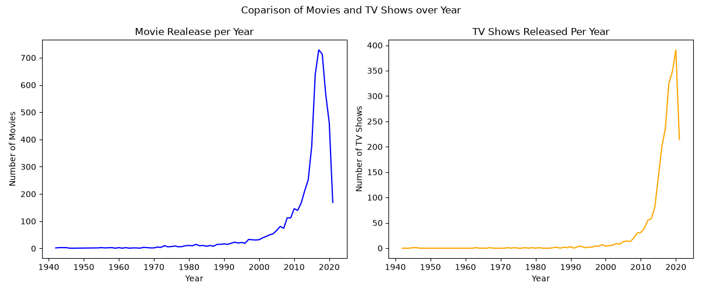
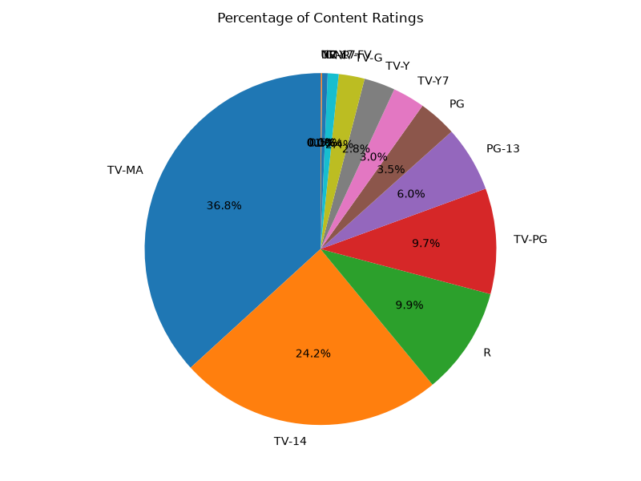
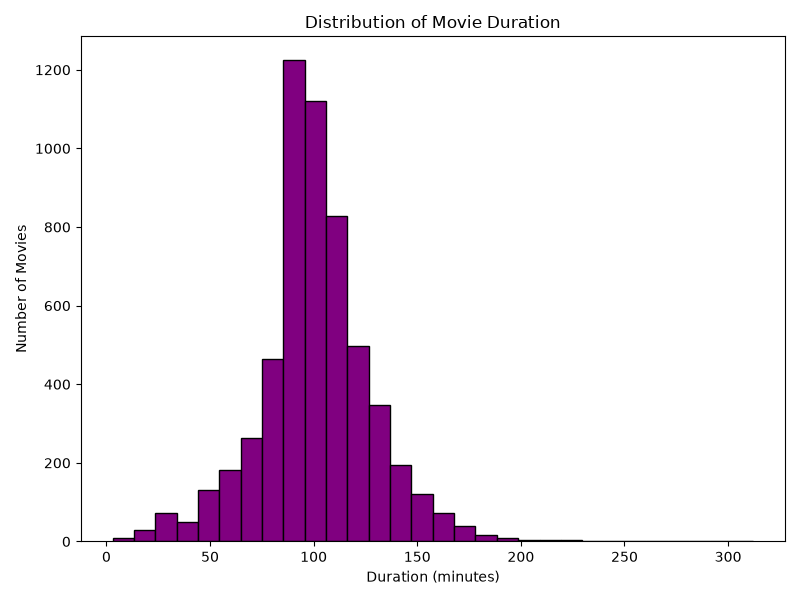
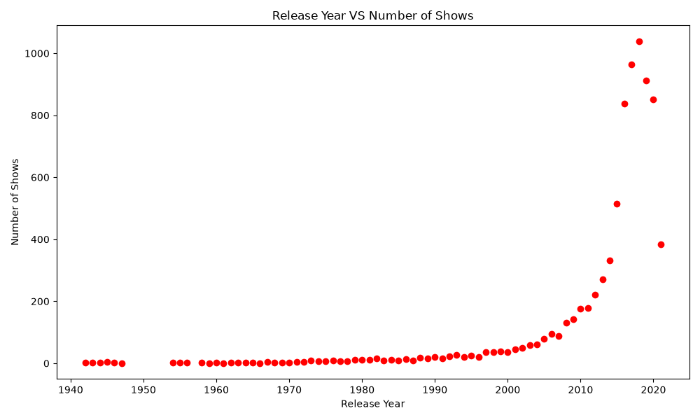
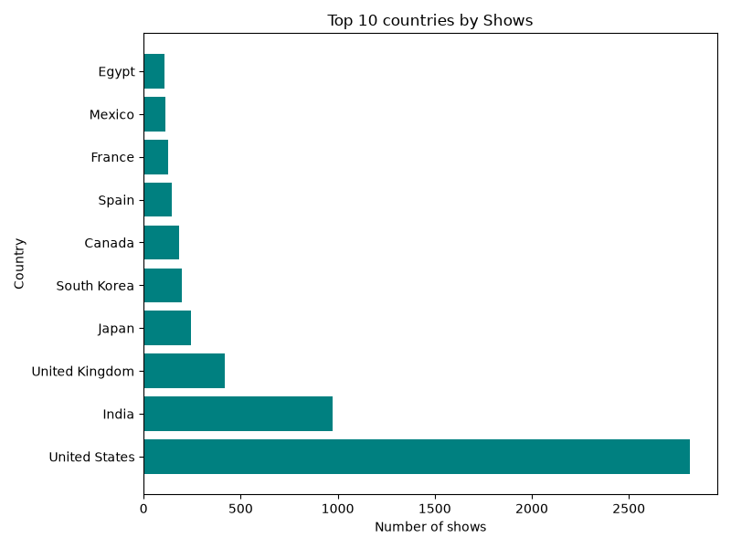

# 🎬 Netflix Data Analysis using Python

An Exploratory Data Analysis (EDA) project analyzing Netflix’s content catalog using **Python**, **Pandas**, and **Matplotlib**. This project explores trends in movie durations, content ratings, regional production distributions, and growth over time.

---

## 📌 Project Overview

The objective of this project is to uncover key insights into how Netflix's content offerings have evolved over the years. By analyzing the dataset, we examine patterns across content types, age ratings, runtime distributions, and top producing countries.

---

## 📊 Key Visualizations & Insights

### 1. Movies vs. TV Shows Comparison
Visualizes the proportion of Movies vs. TV Shows available on the platform using bar plots and time-series subplots.

---

### 2. Content Rating Distribution
A pie chart breakdown showing the percentage distribution of maturity ratings across the library (e.g., TV-MA, TV-14, R, TV-PG).

---

### 3. Movie Duration Analysis
A histogram displaying the distribution of runtime (in minutes) for movies on Netflix, identifying standard movie length trends.

---

### 4. Release Trends Over Time
A scatter plot and line trend plots showing content growth across release years from 1940 to recent years.

---

### 5. Top 10 Content Producing Countries
A horizontal bar chart identifying the top content-producing countries led by the United States, India, and the United Kingdom.

---

## 🛠️ Tech Stack & Libraries

* **Language:** Python
* **Data Manipulation:** Pandas
* **Data Visualization:** Matplotlib

---

## 🎥 Project Demo

Check out the full project walkthrough and video demo on LinkedIn:

👉 [Watch the LinkedIn Video Demo](YOUR_LINKEDIN_POST_URL_HERE)
